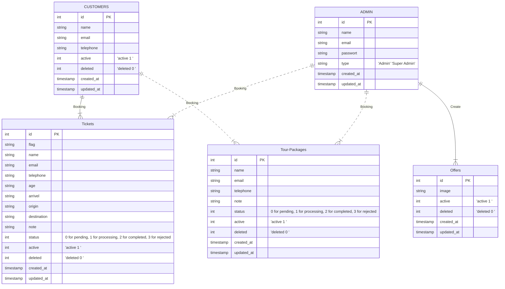

```mermaid
        erDiagram
            CUSTOMERS {
            int id PK
            string name
            string email
            string telephone
            int active " 'active  1 '"
            int deleted " 'deleted 0 ' "
            timestamp created_at
            timestamp updated_at

        }

        Tour-Packages {
            int id PK
            string name
            string email
            string telephone
            string note
            int status "0 for pending, 1 for processing, 2 for completed, 3 for rejected"
            int active " 'active  1 '"
            int deleted " 'deleted 0 ' "
            timestamp created_at
            timestamp updated_at

        }

        Tickets {
            int id PK
            string flag
            string name
            string email
            string telephone
            string age
            string arrivel
            string origin
            string destination
            string note
            int status "0 for pending, 1 for processing, 2 for completed, 3 for rejected"
            int active " 'active  1 '"
            int deleted " 'deleted 0 ' "
            timestamp created_at
            timestamp updated_at
        }

        ADMIN {
            int id PK
            string name
            string email
            string passwort
            string type "'Admin' 'Super Admin'"
            timestamp created_at
            timestamp updated_at
        }

        Offers{
            int id PK
            string image
            int active " 'active  1 '"
            int deleted " 'deleted 0 ' "
            timestamp created_at
            timestamp updated_at
        }

        CUSTOMERS ||--|{ Tickets : Booking
        CUSTOMERS ||..|{ Tour-Packages : Booking
        ADMIN ||..|{ Tickets : Booking
        ADMIN ||..|{ Tour-Packages : Booking
        ADMIN ||--|{ Offers : Create

```